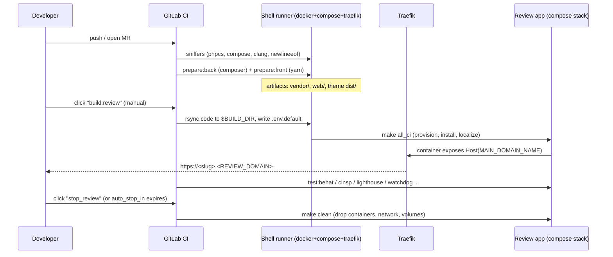

# Review apps

A **review app** is an ephemeral, fully-installed Drupal site that this project builds in GitLab CI
for every merge request (and for the default branch and tags). It lets reviewers click through the
exact code under review at a stable URL, and it is the environment the automated `test:*` jobs run
against.

This document explains how review apps are created, addressed, torn down, and configured. The source
of truth is [`.gitlab-ci.yml`](../.gitlab-ci.yml); the stage-by-stage job reference lives in
[ci-pipeline.md](ci-pipeline.md).

> **This `.gitlab-ci.yml` is a template.** It is designed to be **included by a downstream project's
> pipeline** as a child pipeline — that is why the jobs gate on `$CI_PIPELINE_SOURCE == 'parent_pipeline'`
> and why the `changes:` rules contain a `{{ project.path }}/**/*` placeholder that the parent
> substitutes. A consuming project includes this file, sets a handful of CI/CD variables (below), and
> inherits the whole review-app lifecycle.

## Lifecycle at a glance



## How a review app is built

All three deploy jobs share one YAML anchor, `.deploy_template` (`.gitlab-ci.yml:205`). Its script:

1. `mkdir -p ${BUILD_DIR}` and `rsync` the checkout into `${BUILD_DIR}` (excluding `.git` and
   `.cache`). **`BUILD_DIR` is provided by the runner/parent environment**, not by this file — it is
   the per-app working directory on the runner host.
2. Append two lines to `.env.default` so the stack is uniquely named and addressable:
   - `COMPOSE_PROJECT_NAME=${CI_PROJECT_NAME}-review-${CI_COMMIT_REF_SLUG}`
   - `MAIN_DOMAIN_NAME=${CI_ENVIRONMENT_SLUG}-${CI_PROJECT_PATH_SLUG}.${REVIEW_DOMAIN}`
3. `make all_ci` (`Makefile:61`) — the CI install path: `provision → si → localize → hooksymlink →
   info`. Unlike `make all`, it does **not** run `back`/`front`, because those artifacts were already
   built in the `prepare:*` stage and rsynced in.
4. `make drush config-set system.site name '${CI_COMMIT_REF_SLUG}'` so the site name shows the branch.
5. `chmod` and copy `.cache/` (the SQLite DB) and `web/sites/` back to `${CI_PROJECT_DIR}` so GitLab
   can capture them as artifacts.

The `after_script` prunes dangling Docker networks/containers on the runner.

## How a review app is addressed

The public URL is always:

```
https://${CI_ENVIRONMENT_SLUG}-${CI_PROJECT_PATH_SLUG}.${REVIEW_DOMAIN}
```

Routing is done by **Traefik**, configured through container labels in
[`docker/docker-compose.override.yml.default`](../docker/docker-compose.override.yml.default):

- `traefik.http.routers.web-${COMPOSE_PROJECT_NAME}.rule=Host(\`${MAIN_DOMAIN_NAME}\`)` — match the
  review-app hostname.
- `…tls.certresolver=dns` + `…tls=true` — TLS via the runner's DNS cert resolver.
- `…middlewares.web-${COMPOSE_PROJECT_NAME}.basicauth.users=${RA_BASIC_AUTH}` — optional HTTP basic
  auth. `RA_BASIC_AUTH` is `username:hashed-password` (`htpasswd -nibB user 'pass'`). When set, every
  review URL is protected; `test:lighthouse` authenticates with `RA_BASIC_AUTH_USERNAME/PASSWORD`.

The Mailpit container is published similarly at `mail-${MAIN_DOMAIN_NAME}`.

## The three deploy jobs and their TTLs

The environment block (URL, name, `on_stop`, `auto_stop_in`) comes from one of three TTL anchors that
each deploy job merges on top of `.deploy_template`:

| Job | Trigger | `when` | TTL anchor | `auto_stop_in` | Notes |
| --- | --- | --- | --- | --- | --- |
| `build:review` | MR pipeline (`$CI_MERGE_REQUEST_IID`) | `manual` | `…ttl_mid` | **1 week** | The everyday reviewer flow |
| `build:master` | default branch | `always` | `…ttl_long` | **1 month** | Auto-deploys the integration env |
| `build:tag` | tag pipeline (`$CI_COMMIT_TAG`) | `manual` | `…ttl_short` | **1 day** | Also archives `web/sites/*/files/` + `.cache` as a 1-week artifact (used by `test:deploy`) |

All three point `environment.name` at `review/${CI_COMMIT_REF_NAME}` with `on_stop: stop_review`, so
GitLab shows a single environment per ref with a stop button.

## Tearing a review app down

- **`stop_review`** (`.gitlab-ci.yml:290`) — `when: manual`, `GIT_STRATEGY: none`,
  `environment.action: stop`. Runs `make clean` inside `${BUILD_DIR}` (drops containers, network,
  volumes, composer-installed code, DB data) then `rm -rf ${BUILD_DIR}`. It is the `on_stop` handler,
  so GitLab also calls it automatically when `auto_stop_in` expires.
- **`generate:logins`** (`.gitlab-ci.yml:316`) — `when: manual`, runs `make info` to print one-click
  admin/tester login links and the container IPs for a running app.

## Required GitLab CI/CD variables

Set these in the **consuming project** under *Settings → CI/CD → Variables*:

| Variable | Required? | Purpose |
| --- | --- | --- |
| `REVIEW_DOMAIN` | **Yes** | DNS domain of the review runner (`docker + compose + traefik`); forms the URL |
| Runner tag (`.runner_tag_selection`) | **Yes** | The shell runner that has docker/compose/traefik (edit the `XXX` tag) |
| `THEME_PATH` | If a theme | Enables `sniffers:front` / `prepare:front` / `test:storybook` (`web/themes/custom/XXX`) |
| `STORYBOOK_PATH` | If storybook | Enables `test:storybook` and prints the storybook URL |
| `RA_BASIC_AUTH` | Optional | `user:hashed-pass` for Traefik basic auth on review URLs |
| `RA_BASIC_AUTH_USERNAME` / `RA_BASIC_AUTH_PASSWORD` | If basic auth | Lets `test:lighthouse` reach a protected app |
| `TEST_UPDATE_DEPLOYMENTS` | Optional | `"TRUE"` enables `test:deploy` (update-path simulation) |
| `GITLAB_PROJECT_ACCESS_TOKEN` | For `test:deploy` | Token with `read_api`+`read_repository` to fetch the last tag's artifacts |
| `GITLAB_PROJECT_BASIC_AUTH` | For `test:deploy` | Encoded creds if the repo itself is behind basic auth |
| `RUN_PATCHVAL_CI_JOB` | Optional | Set `"FALSE"` to skip `test:patch` (e.g. unavoidable private-package patches) |
| `NEW_RELIC_LICENSE_KEY` | Optional | Enables the NewRelic PHP agent in the build (`make newrelic`) |
| `IMAGE_PHP` | Optional | Override the PHP image (CI default `skilldlabs/php:83`) |

## Local equivalent

The same Makefile mechanics power local development — `make all` builds the identical stack, and a
unique `COMPOSE_PROJECT_NAME` is all that separates two stacks. To run **several review-app-like
stacks at once locally** (one per branch), see [parallel-environments.md](parallel-environments.md).

## See also

- [ci-pipeline.md](ci-pipeline.md) — every stage and job, and the job → `make` target → script map.
- [architecture.md](architecture.md) — what runs inside the review-app container.
- [observability.md](observability.md) — logs and traces from a running app.
